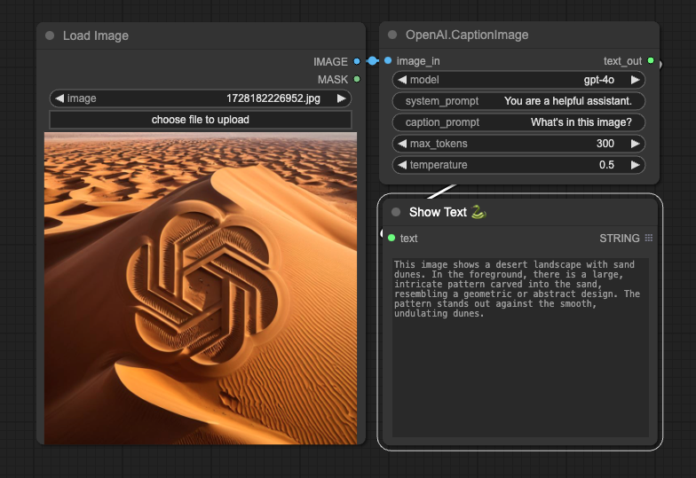

# ComfyUI OpenAI Nodes



### Get Your OpenAI API Key

To use the ComfyUI OpenAI Nodes, you'll need an API key from OpenAI. Here's how to get one:

1. Go to [OpenAI's website](https://openai.com/) and sign up for an account if you haven't already.
2. Once logged in, navigate to the [API keys page](https://platform.openai.com/api-keys).
3. Click on "Create new secret key" to generate a new API key.
4. Copy the key immediately and store it securely. You won't be able to see it again!

Remember to keep your API key confidential and never share it publicly. You'll need to input this key when using the OpenAI nodes in ComfyUI.

Note: OpenAI's services are not free. Make sure you're familiar with their [pricing structure](https://openai.com/pricing) before using the API extensively.

### Saving Your API Key

To securely store your OpenAI API key:

1. Create a file named `.env` in the root folder of your ComfyUI installation.
2. Add the following line to the `.env` file:
   ```
   OPENAI_API_KEY=your_api_key_here
   ```
   Replace `your_api_key_here` with your actual OpenAI API key.
3. Save the file.

This method allows you to keep your API key secure and separate from your code.

### Installation and Usage

1. Navigate to ComfyUI/custom_nodes folder in terminal or command prompt.
2. Clone the repo using the following command:
   `git clone https://github.com/ComfyUI-Workflow/ComfyUI-OpenAI`
3. Go to `custom_nodes/ComfyUI-OpenAI` and install depedencies by running `pip install -r requirements.txt`
4. Restart ComfyUI

## Features(More to come)

### Image Captioning

This node uses OpenAI's vision models for image captioning. It lets you choose:

- **model**: Choose from a variety of OpenAI models
- **system_prompt**: Customize the system prompt to guide the AI's behavior
- **caption_prompt**: Specify a captioning prompt to focus the AI's description
- **max_tokens** and **temperature**: Fine-tune the output length and creativity
- **api_key**: Input your OpenAI API key for authentication

These parameters allow you to customize the captioning process to suit your specific needs and preferences. You can adjust the model selection, prompts, and generation settings to achieve the desired output for your image captioning tasks.

Key features:

- No need to run your own captioning infrastructure
- Flexible configuration options
- Seamless integration with ComfyUI workflows

Example use cases:

- Generating detailed descriptions of generated images
- Creating alt text for accessibility
- Analyzing visual content in various domains (e.g., medical, scientific, artistic)

By utilizing OpenAI's powerful vision models, this node enables you to incorporate state-of-the-art image understanding into your ComfyUI projects with minimal setup.
